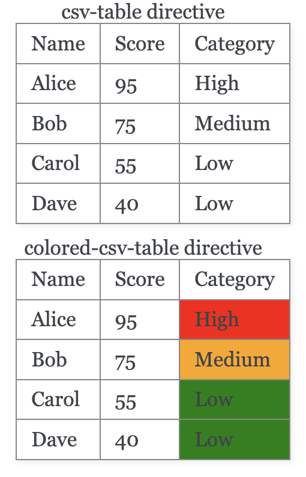
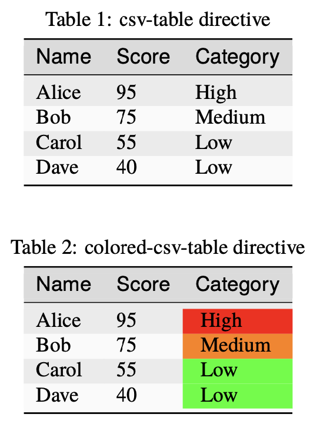

# sphinx-colored-tables

This extension enables options for coloring the cells of a column
based on the value in that cell.

## Limitations

This extension extends the `.. csv-table::` directive
and has only been tested on cells with a single value in it.

This repo isn't set up as other sphinx extensions at the moment. To use,
copy the extensions folder into your personal project, set up your
custom css if building html, and update your `conf.py`.

## Usage

When using the `.. colored-csv-table::` directive, two new options are included:
`:color-column` and `:color-map:`.

These directives

```{rst}
.. csv-table:: csv-table directive
   :file: _static/sample.csv
   :header-rows: 1
   :align: center

.. colored-csv-table:: colored-csv-table directive
   :file: _static/sample.csv
   :header-rows: 1
   :align: center
   :color-column: Category
   :color-map: High=red, Medium=orange, Low=green
```

will produce this html output



and this LaTeX output


